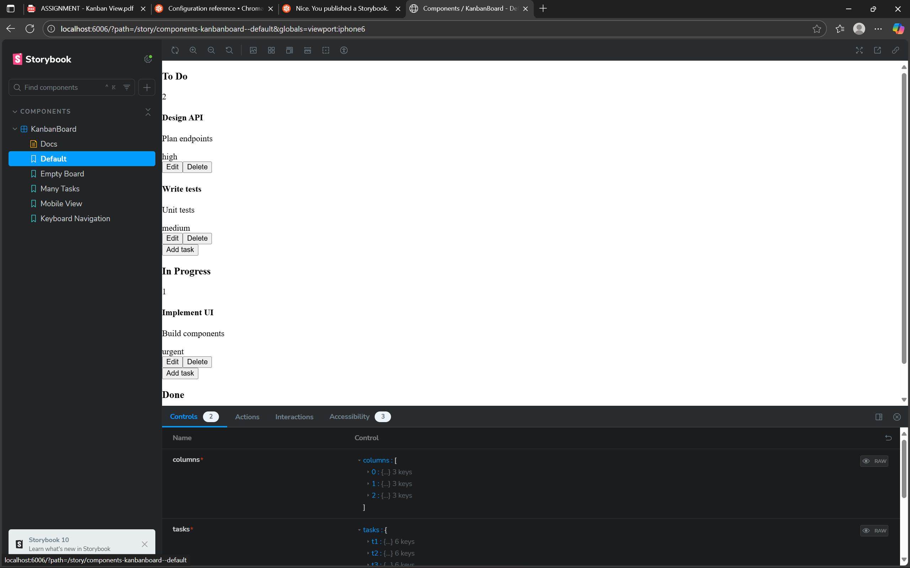
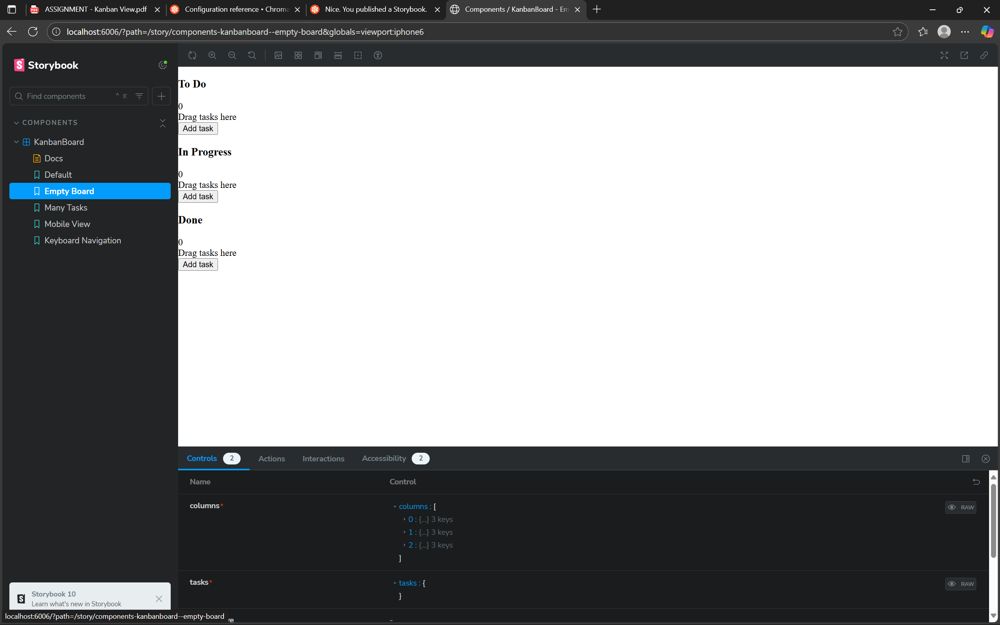
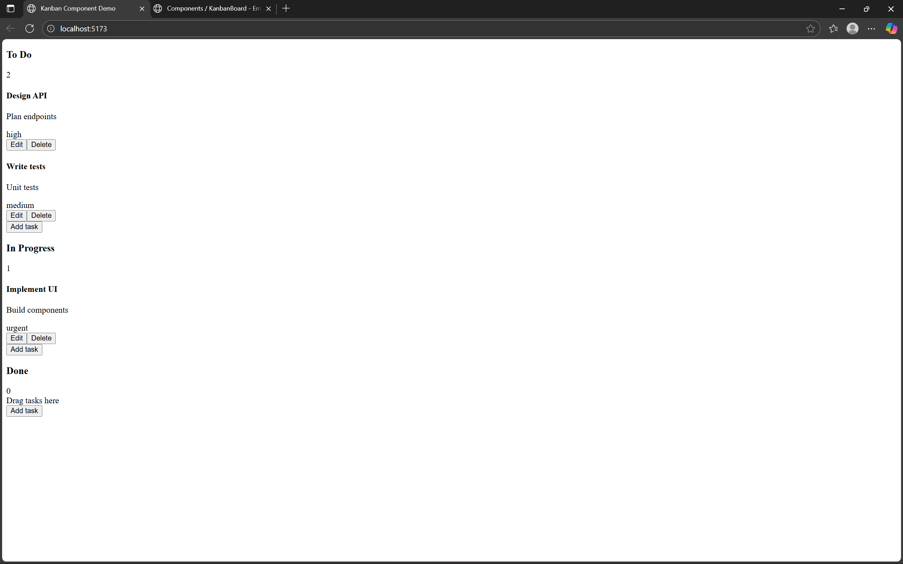

# Kanban Board Component

A reusable Kanban Board UI component built from scratch with React, TypeScript, Tailwind CSS, and Storybook. It focuses on clean architecture, accessibility (WCAG‑minded), and performant interactions for a modern SaaS‑style Kanban experience.

---

## Table of Contents

- [Live Storybook](#live-storybook)
- [Screenshots](#screenshots)
- [Features](#features)
- [Tech Stack](#tech-stack)
- [Getting Started](#getting-started)
  - [Prerequisites](#prerequisites)
  - [Install](#install)
  - [Run Storybook](#run-storybook)
  - [Optional: Vite App Preview](#optional-vite-app-preview)
- [Project Structure](#project-structure)
- [Usage (Component)](#usage-component)
- [Accessibility](#accessibility)
- [Performance Notes](#performance-notes)
- [Scripts](#scripts)
- [Roadmap](#roadmap)
- [Contributing](#contributing)
- [License](#license)
- [Contact](#contact)

---

## Live Storybook

- Deployed: https://www.chromatic.com/setup?appId=69035293714b8de9f68d5435
- Local: http://localhost:6006

> The Storybook documents the component in isolation with Default and Empty states, plus interactive demos.

---
## Deploying Storybook (Chromatic)

Used the Chromatic CLI to publish Storybook.

## Screenshots

---

## Features

- Columns with ordered task lists, sticky headers, horizontal scrolling, and empty states
- Task cards with title, description, priority label, and actions (edit/delete)
- Drag‑and‑drop via native HTML5 API with guarded state updates
- Keyboard navigation: Tab/Shift+Tab, Space/Enter to pick/drop, Arrow keys to move
- ARIA roles/labels for columns, cards, and modal dialogs
- Strict TypeScript models and clean component contracts
- Tailwind CSS utility‑first styling and design tokens
- Storybook stories for fast review and isolated testing

---

## Tech Stack

- React 18 + TypeScript
- Tailwind CSS
- Storybook
- Vite (dev/build tooling for optional app preview)

---

## Getting Started

### Prerequisites

- Node.js 18+ and npm

### Install

git clone https://github.com/Yash200305/kanban-component
cd kanban-component
npm install

### Run Storybook

npm run storybook

open http://localhost:6006

### Optional: Vite App Preview

Added `index.html` and `src/main.tsx` to mount the component in a tiny app shell:
npm run dev

open the printed Vite URL (e.g., http://localhost:5173)

---

## Project Structure

kanban-component/
├─ README.md
├─ package.json
├─ tsconfig.json
├─ tailwind.config.js
├─ vite.config.ts # optional but recommended
├─ .storybook/
│ ├─ main.ts
│ └─ preview.ts
└─ src/
├─ components/
│ ├─ KanbanBoard/
│ │ ├─ KanbanBoard.tsx
│ │ ├─ KanbanBoard.stories.tsx
│ │ ├─ KanbanBoard.types.ts
│ │ ├─ KanbanColumn.tsx
│ │ ├─ KanbanCard.tsx
│ │ └─ TaskModal.tsx
│ └─ primitives/
│ ├─ Button.tsx
│ ├─ Modal.tsx
│ └─ Avatar.tsx
├─ hooks/
│ ├─ useDragAndDrop.ts
│ └─ useKanbanBoard.ts
├─ utils/
│ ├─ task.utils.ts
│ └─ column.utils.ts
└─ styles/
└─ globals.css

---

## Usage (Component)

import { KanbanBoard } from './components/KanbanBoard/KanbanBoard';
import type { KanbanColumn, KanbanTask } from './components/KanbanBoard/KanbanBoard.types';

const now = new Date().toISOString();

const columns: KanbanColumn[] = [
{ id: 'todo', title: 'To Do', taskIds: ['t1', 't2'] },
{ id: 'inprogress', title: 'In Progress', taskIds: ['t3'] },
{ id: 'done', title: 'Done', taskIds: [] }
];

const tasks: Record<string, KanbanTask> = {
t1: { id: 't1', title: 'Design API', description: 'Plan endpoints', priority: 'high', createdAt: now, updatedAt: now },
t2: { id: 't2', title: 'Write tests', description: 'Unit tests', priority: 'medium', createdAt: now, updatedAt: now },
t3: { id: 't3', title: 'Implement UI', description: 'Build components', priority: 'urgent', createdAt: now, updatedAt: now }
};

export function App() {
return <KanbanBoard columns={columns} tasks={tasks} />;
}

---

## Accessibility

- Keyboard support: Tab/Shift+Tab for focus, Space/Enter to pick/drop, Arrow keys to move cards
- ARIA: roles and labels on columns, cards, and dialogs
- Visuals: focus‑visible outlines and sufficient color contrast
- Screen reader announcements for drag actions (recommended enhancement)

---

## Performance Notes

- Stable child renders: `React.memo` where appropriate
- Stable handlers: `useCallback` and computed values via `useMemo`
- Immutable state updates to keep reconciliation predictable
- Consider list virtualization when any single column exceeds ~50+ items

---

## Scripts

{
"scripts": {
"dev": "vite", // optional app preview
"build": "vite build",
"preview": "vite preview",
"storybook": "storybook dev -p 6006",
"build-storybook": "storybook build",
"typecheck": "tsc --noEmit"
}
}

---

## Roadmap

- Column drag to reorder lanes
- Bulk selection and actions
- Advanced filtering/search
- Virtualized columns for very large datasets
- Dark mode story and theme tokens

---

## Contributing

1. Fork the repo
2. Create a feature branch: `git checkout -b feat/your-feature`
3. Commit changes: `git commit -m "feat: describe your change"`
4. Push branch: `git push origin feat/your-feature`
5. Open a Pull Request

Please follow conventional commits for clear history.

---

## License

Add a license of your choice (e.g., MIT). If you intend to open‑source, include `LICENSE` at the repository root.

---

## Contact

- Author: Yash Pathak
- Email: pathakyash350@gmail.com
- Repo: (https://github.com/Yash200305/kanban-component)

